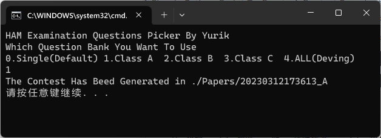
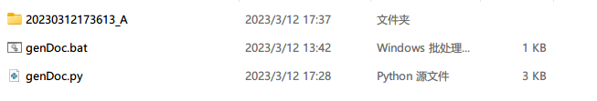
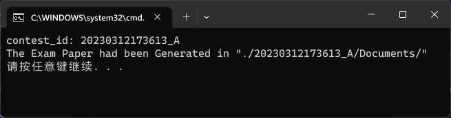

# HAM Examination Paper Generator
A Simple Python Script To Create A Contest Examination Paper

## How To Use it?

1. use **genPaper** to create a new Contest

   

2. copy the folder to **genDocuments**, the folder name is the content_id, it's for step 3
	

3. use **genDoc.bat** to generator Word Documents

   

4. Don't Forget To Edit The Style of the document

